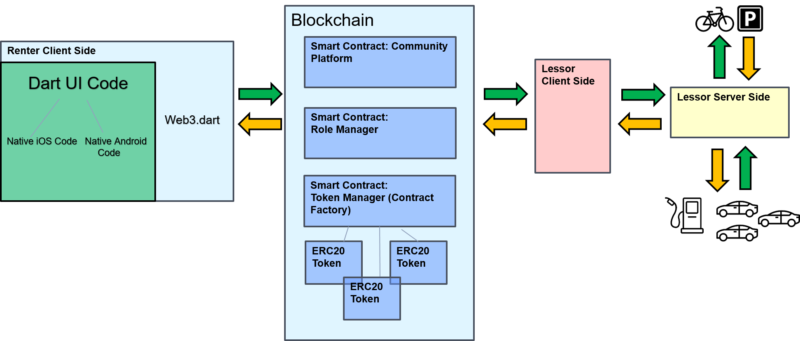

## Community

Community is a Blockchain Mobility Sharing platform that allows companies, small businesses, and individuals to lease out sharing objects (cars, motorbikes, bikes, charging stations, parking lots) to users. The platform features an Ethereum based on-chain government model and verifiable fiat money to token exchange. The client that interacts with the Blockchain is built with Flutter, which compiles a single codebase to an Android and iOS app. 

Tools used: Flutter, Web3, Solidity 
   
## Demo

## Architecture

Lessors offer rental objects on the Ethereum Blockchain. Renters use the iOS/Android app to rent objects. The mobile app interacts with the Blockchain via Web3. Renters can exchange fiat money for ERC20 tokens to pay for their rents. Instead of deploying the Smart Contract on the Ethereum main chain, deploying it on a Proof-of-Authority chain is recommended. Each lessor, verifier, or token issuer might be an authority on the chain to ensure its integrity. 

## Getting Started
More detailed instructions are available in the respective folders for Frontend and Smart Contracts.

### Backend
1. Deploy Smart Contract on an Ethereum Blockchain

### Frontend
1. Insert Blockchain API, contract address, and Google Maps API Key in config.dart
2. Compile the code to an Android or iOS App using [Flutter](https://flutter.dev/docs/get-started/install)
